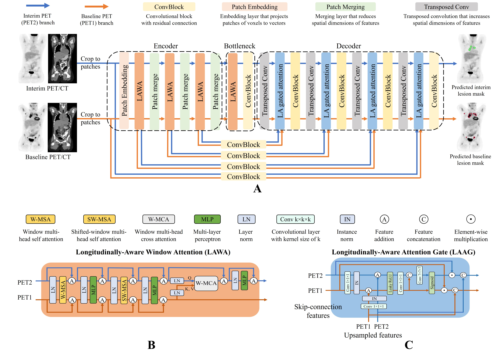

# Longitudinally-Aware Segmentation Network (LAS-Net) for Pediatric Hodgkin Lymphoma :bookmark_tabs:

This repository contains the code for the paper [**Automatic Quantification of Serial PET/CT Images for Pediatric Hodgkin Lymphoma Patients Using a Longitudinally-Aware Segmentation Network**](https://arxiv.org/abs/2404.08611) (under review).

## Overview :mag_right:
**Summary**: 
A longitudinally-aware segmentation network (LAS-Net) trained on multi-center clinical trial data achieved high performance in automatic quantification of PET metrics for baseline and interim-therapy scans in pediatric Hodgkin lymphoma. 

**Key Points**:
- :chart_with_upwards_trend: LAS-Net leverages information from baseline PET images to inform and improve the analysis of interim PET, achieving an F1 score of 0.606 in detecting residual lymphoma, which was significantly better than models without longitudinal awareness (P<0.01).
- :trophy: When analyzing baseline PET/CT images, LAS-Net attained a mean Dice score of 0.772, demonstrating comparable performance to the best comparator method (P=0.32).
- :medal_sports: The quantitative PET metrics measured by LAS-Net, including qPET, ∆SUVmax, metabolic tumor volume (MTV) and total lesion glycolysis (TLG), were highly correlated with physician measurements, with Spearman’s correlations of 0.78, 0.80, 0.93 and 0.96, respectively. 

## Design Principle :triangular_ruler:
We designed LAS-Net with a dual-branch architecture to accommodate baseline and interim PET/CT images, as illustrated below. One branch exclusively processes baseline PET (PET1) and predicts the corresponding lesion masks. The other branch focuses on interim PET (PET2), but also utilizes information extracted from the PET1 branch to generate masks of residual lymphoma. This architecture enables our model to gather useful information from PET1 to inform and improve the analysis of subsequent scans. Meanwhile, it ensures a one-way information flow, preventing PET2 information from influencing PET1 analysis. 




## Installation 🛠

To run this project, you can use a pre-configured **Docker** container for easy setup. The Docker image is hosted on Docker Hub.

### Steps:

1. **Clone the repository**:
   ```bash
   git clone https://github.com/xtie97/LAS-Net.git
   ```
2. **Pull the Docker image from Docker Hub**:
    ```bash
   docker pull xtie97/monai_wb
   ```
3. **Run the Docker container**:
   ```bash
   docker run -it --rm -v $(pwd):/workspace xtie97/monai_wb
   ```

## Preprocessing 🧩
The baseline and interim PET/CT images should be spatially aligned using either rigid or deformable registration. We used [ANTsPy](https://github.com/ANTsX/ANTsPy) for automatic registration. It is not guaranteed that this automatic registration approach can always provide acceptable results. We do recommend manual verification. For cases requiring manual registration, consider tools like MIM. 

All images were resampled to an isotropic voxel size of 3 mm using trilinear interpolation, with an input patch size of 112×112×112.


## Usage 🚀
To train or evaluate the model, please open and modify the **configs/hyper_parameters.yaml** file to adjust parameters and update the paths for your data root and data list:

Starting training by runing the following command:
```bash
python main.py
```
To run inference, please change the following in the **configs/hyper_parameters.yaml** file:
```bash
infer: {enabled: true, ckpt_name: $@ckpt_path + '/model.pt', output_path: $@bundle_root
    + '/prediction_' + @infer#data_list_key + '', data_list_key: testing}  
```

We released our model weights in [**Dropbox**](https://www.dropbox.com/scl/fo/6ihu7tjk2yqe75bylyy0t/h?rlkey=79nzdg6ouzx8tddot693z6c1e&st=4jlqmtvi&dl=0). The model configuration can be specified in **`scripts/model.py`**:
```python
model = LASNet(
      img_size=img_size,
      in_channels=in_channels,
      out_channels=n_class,
      feature_size=48,
      num_heads=[3, 6, 12, 24],
      spatial_dims=3,
      deep_supr_num=3,
      use_checkpoint=True,
      use_v2=False,
      )
```

We also tried to scale our model by increasing the embedding dimension and adding a residual block before each Swin Transformer block (for details, refer to [SwinUNETR-V2](https://link.springer.com/chapter/10.1007/978-3-031-43901-8_40)). The corresponding model configuration (in **`scripts/model.py`**) is as follows:
```python
model = LASNet(
      img_size=img_size,
      in_channels=in_channels,
      out_channels=n_class,
      feature_size=64,
      num_heads=[4, 8, 16, 32],
      spatial_dims=3,
      deep_supr_num=3,
      use_checkpoint=True,
      use_v2=True,
      )
```
The model weights can be found in [**Dropbox**](https://www.dropbox.com/scl/fo/5k79nn3wibpp8vytchaq9/AIeel2joOwXjCCEWPkSHIRQ?rlkey=0pjjnd8eeyo7iwawxe9vsjgeb&st=7ouarfoe&dl=0).

Since this work is focused on high-risk pediatric Hodgkin lymphoma, and given that treatment responses can vary significantly across lymphoma subtypes, the current models may not work well in other lymphoma diseases. We recommend either training a model from scractch or using our weights for initialization to better align with your specific task and dataset.

## Future Directions :dart:
- **Further Improve Residual Lesion Detection**: Although incorporating prior information from baseline PET/CT scans shows clear advancements in residual lesion detection, there is still room for further improvements. Strategies such as *model pre-training, semi-supervised techniques, more parameter-efficient or memory-efficient cross-attention, advanced feature fusion techniques, and access to larger datasets* may help improve the performance and address current challenges in automatic residual lesion detection.
  
- **Unified Framework for Multi-Timepoint Analysis**: The LAS-Net model is primarily designed for interim PET lesion detection, but it can also be used for baseline PET segmentation. Extending the model to *operate across more than two imaging time points* (e.g., add end-of-treatment (EoT) PET/CT) could be an intriguing yet challenging topic. Achieving this will likely require adaptations in model architecture and careful data pre-processing. 

## Citation 📚


